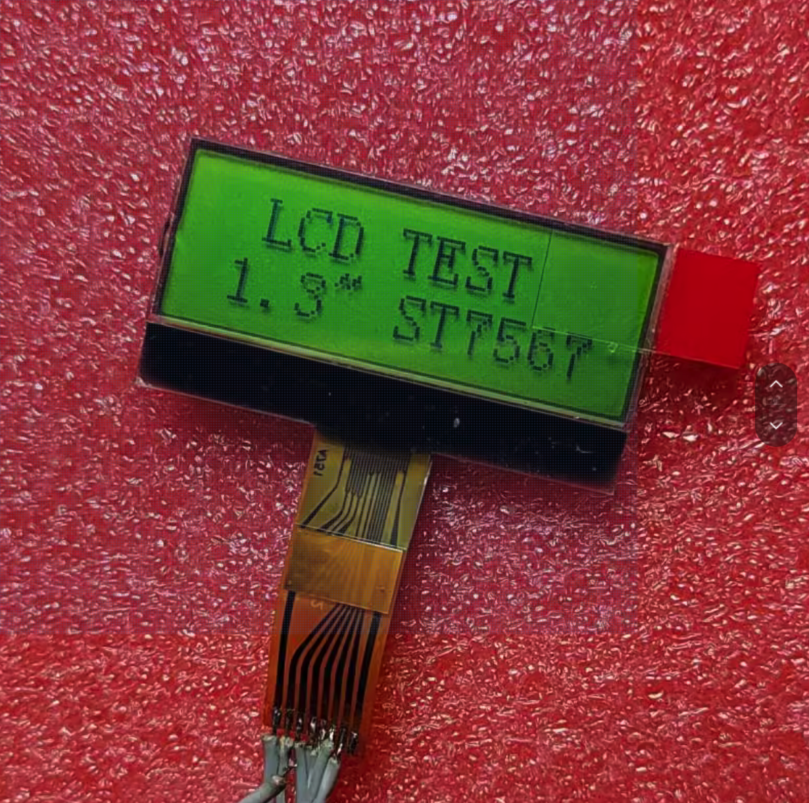
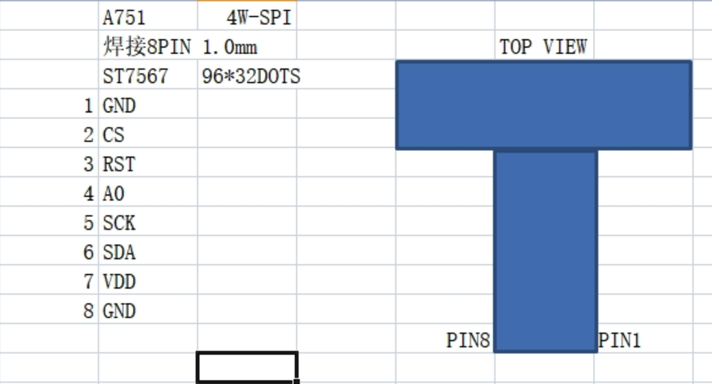

# ST7567 lcd 屏幕

完全适配山岩数码家的1.3寸屏幕，屏幕如图所示

## 使用示例

```c++
#include "ST7567.h"

#define CS_PIN 9
#define RST_PIN 20
#define A0_PIN 10
#define SCK_PIN 6
#define SDA_PIN 7

void setup() {
  display_init(CS_PIN, RST_PIN, A0_PIN, SCK_PIN, SDA_PIN, 16);
}

void loop() {
  // test
  display_rest();
  draw_string(0, 0, "hello, qing");
  delay(1000);
  display_inverse(1);
  delay(1000);
  display_inverse(0);
  delay(2000);
  display_rest();
  draw_fill_rect(0,0,20,10,1);
  draw_line(0,20,30,30);
  draw_rect(50,0,30,30);
  draw_circle(70,20,10);
  draw_fill_circle(90,20,5,1);

  delay(5000);
}

```

# 引脚接线



# 资料

见[文档资料](doc/ST7567_DS.pdf)
